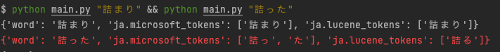

# cognitive-search-analyzer-sandbox
cognitive-search-analyzer を試して比較するための script

# set up

```
pip install xtermcolor
pip install requests
pip install python-dotenv
```

以下の環境変数を設定する or .env を用いて設定する

```
export COGNITIVE_SEARCH_API_KEY=<COGNITIVE_SEARCH_API_KEYを指定>
export API_VERSION=<API_VERSIONを指定>
export COGNITIVE_SEARCH_NAME=<COGNITIVE_SEARCH_NAMEを指定>
export COGNITIVE_SEARCH_INDEX_NAME=<COGNITIVE_SEARCH_INDEX_NAMEを指定>
```
# 実行

```
python main.py "詰った"
```

ja.lucene と ja.microsoft で結果が異なる場合は赤色になる

